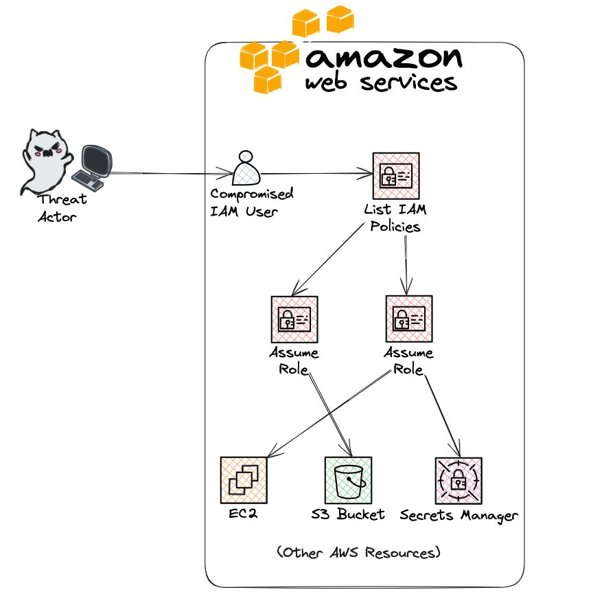

# AWS Red Teaming: TTPs

When threat actors compromise an AWS user, they often follow a systematic process of enumeration and lateral movement to expand their access and gather sensitive information.  
Here's a breakdown of how attackers perform these activities using various AWS CLI commands.  
The first step an attacker takes is to identify the compromised IAM user and account details:  
```console
𝙖𝙬𝙨 𝙨𝙩𝙨 𝙜𝙚𝙩-𝙘𝙖𝙡𝙡𝙚𝙧-𝙞𝙙𝙚𝙣𝙩𝙞𝙩𝙮
```  

Next, attackers gather more details about the IAM user (creation date, tags, and other metadata):  
```console
𝙖𝙬𝙨 𝙞𝙖𝙢 𝙜𝙚𝙩-𝙪𝙨𝙚𝙧 --𝙪𝙨𝙚𝙧-𝙣𝙖𝙢𝙚 <𝙪𝙨𝙚𝙧𝙣𝙖𝙢𝙚>
```  


To understand the user's permissions, attackers check for group memberships and attached policies:  
```console
𝙖𝙬𝙨 𝙞𝙖𝙢 𝙡𝙞𝙨𝙩-𝙜𝙧𝙤𝙪𝙥𝙨-𝙛𝙤𝙧-𝙪𝙨𝙚𝙧 --𝙪𝙨𝙚𝙧-𝙣𝙖𝙢𝙚 <𝙪𝙨𝙚𝙧𝙣𝙖𝙢𝙚>
𝙖𝙬𝙨 𝙞𝙖𝙢 𝙡𝙞𝙨𝙩-𝙖𝙩𝙩𝙖𝙘𝙝𝙚𝙙-𝙪𝙨𝙚𝙧-𝙥𝙤𝙡𝙞𝙘𝙞𝙚𝙨 --𝙪𝙨𝙚𝙧-𝙣𝙖𝙢𝙚 <𝙪𝙨𝙚𝙧𝙣𝙖𝙢𝙚>
𝙖𝙬𝙨 𝙞𝙖𝙢 𝙡𝙞𝙨𝙩-𝙪𝙨𝙚𝙧-𝙥𝙤𝙡𝙞𝙘𝙞𝙚𝙨 --𝙪𝙨𝙚𝙧-𝙣𝙖𝙢𝙚 <𝙪𝙨𝙚𝙧𝙣𝙖𝙢𝙚>
```  

Attackers need to understand the permissions granted by these policies:  
```console
𝙖𝙬𝙨 𝙞𝙖𝙢 𝙡𝙞𝙨𝙩-𝙥𝙤𝙡𝙞𝙘𝙮-𝙫𝙚𝙧𝙨𝙞𝙤𝙣𝙨 --𝙥𝙤𝙡𝙞𝙘𝙮-𝙖𝙧𝙣 <𝙥𝙤𝙡𝙞𝙘𝙮-𝙖𝙧𝙣>
𝙖𝙬𝙨 𝙞𝙖𝙢 𝙜𝙚𝙩-𝙥𝙤𝙡𝙞𝙘𝙮-𝙫𝙚𝙧𝙨𝙞𝙤𝙣 --𝙥𝙤𝙡𝙞𝙘𝙮-𝙖𝙧𝙣 <𝙥𝙤𝙡𝙞𝙘𝙮-𝙖𝙧𝙣> --𝙫𝙚𝙧𝙨𝙞𝙤𝙣-𝙞𝙙 <𝙫𝙚𝙧𝙨𝙞𝙤𝙣-𝙞𝙙>
```  


After understanding the permissions, attackers can move laterally by assuming roles or accessing other resources:  
```console
𝙖𝙬𝙨 𝙞𝙖𝙢 𝙜𝙚𝙩-𝙧𝙤𝙡𝙚 --𝙧𝙤𝙡𝙚-𝙣𝙖𝙢𝙚 <𝙧𝙤𝙡𝙚-𝙣𝙖𝙢𝙚>
𝙖𝙬𝙨 𝙨𝙩𝙨 𝙖𝙨𝙨𝙪𝙢𝙚-𝙧𝙤𝙡𝙚 --𝙧𝙤𝙡𝙚-𝙖𝙧𝙣 <𝙧𝙤𝙡𝙚-𝙖𝙧𝙣> --𝙧𝙤𝙡𝙚-𝙨𝙚𝙨𝙨𝙞𝙤𝙣-𝙣𝙖𝙢𝙚 <𝙨𝙚𝙨𝙨𝙞𝙤𝙣-𝙣𝙖𝙢𝙚>
```  


With new permissions granted, attackers can access sensitive data like S3 bucket contents, EC2 instances or secrets stored in Secrets Manager:  
```console
𝙖𝙬𝙨 𝙚𝙘2 𝙙𝙚𝙨𝙘𝙧𝙞𝙗𝙚-𝙞𝙣𝙨𝙩𝙖𝙣𝙘𝙚𝙨
𝙖𝙬𝙨 𝙨𝙚𝙘𝙧𝙚𝙩𝙨𝙢𝙖𝙣𝙖𝙜𝙚𝙧 𝙡𝙞𝙨𝙩-𝙨𝙚𝙘𝙧𝙚𝙩𝙨
𝙖𝙬𝙨 𝙨𝙚𝙘𝙧𝙚𝙩𝙨𝙢𝙖𝙣𝙖𝙜𝙚𝙧 𝙜𝙚𝙩-𝙨𝙚𝙘𝙧𝙚𝙩-𝙫𝙖𝙡𝙪𝙚 --𝙨𝙚𝙘𝙧𝙚𝙩-𝙞𝙙 <𝙨𝙚𝙘𝙧𝙚𝙩-𝙞𝙙>
𝙖𝙬𝙨 𝙨3 𝙡𝙨 𝙨3://<𝙗𝙪𝙘𝙠𝙚𝙩-𝙣𝙖𝙢𝙚>
𝙖𝙬𝙨 𝙨3 𝙘𝙥 𝙨3://<𝙗𝙪𝙘𝙠𝙚𝙩-𝙣𝙖𝙢𝙚>/𝙥𝙖𝙨𝙨𝙬𝙤𝙧𝙙𝙨.𝙩𝙭𝙩 .
```  

  
