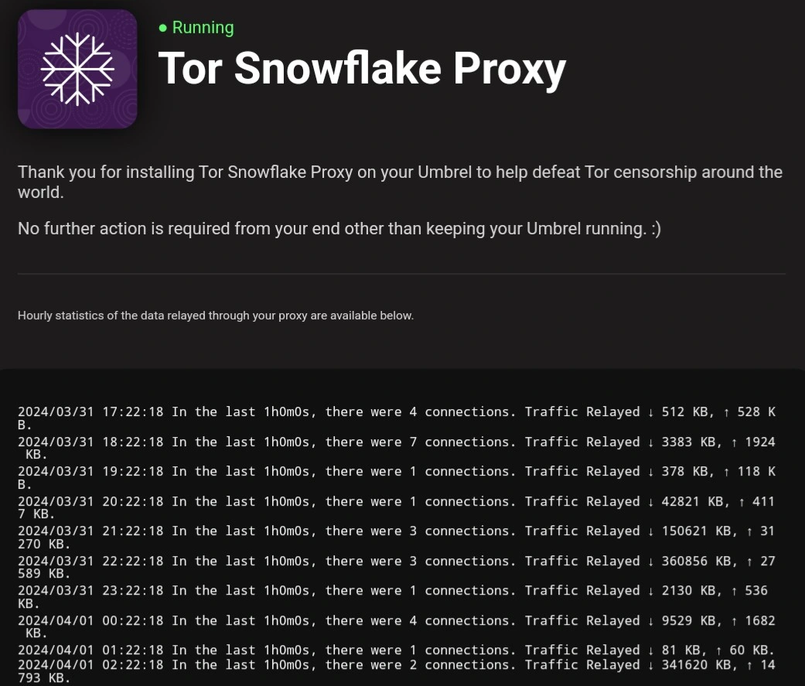

# Domain Fronting
𝐃𝐨𝐦𝐚𝐢𝐧 𝐅𝐫𝐨𝐧𝐭𝐢𝐧𝐠 is an intriguing evasion technique that can be employed in both malicious contexts and to circumvent internet censorship in authoritarian regimes.  

This method typically capitalizes on the capability to specify a different host header in HTTPS requests, distinct from the requested destination.  
It commonly involves utilizing a Content Delivery Network (CDN) that hosts numerous domains, encompassing both the front domain and the target domain.  

Basically, we can hide an HTTPS request to a "bad" site inside a TLS connection to a "good" site.  

In the demonstration below, we illustrate a hypothetical scenario where '*aws*' is blocked, but '*amazon*' is not, and how we can still access '*aws*' using this technique (you can test this by 'blocking' aws domain locally by modifying your hosts file):  


```console
wget --tries 1  --timeout=3 https://aws.amazon.com

Operation timed out
```  

```console
wget -q -O - https://www.amazon.com --header 'Host: aws.amazon.com' | grep -o '<title>.*</title>'

<title>Cloud Computing Services - Amazon Web Services (AWS)</title>
```  

If you wish to assist in preventing internet censorship, you can volunteer to run [*Snowflake*](https://snowflake.torproject.org/).  
Snowflake is a proxy that employs *domain fronting* to enable access to the [*Tor network*](https://en.wikipedia.org/wiki/Tor_(network)):  

  


- [Back to main page](../../../index.md)  