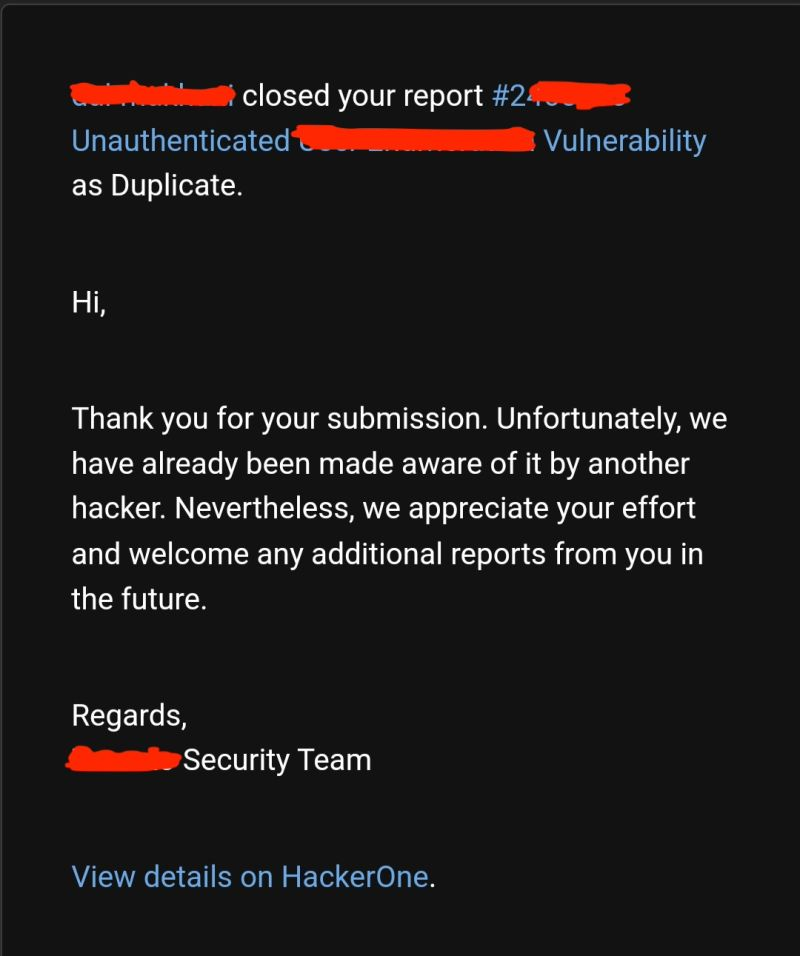

# The Problem with Bug Bounty

Everything that's wrong with bug bounty in a single image.  
No matter how much effort you invest or how objectively severe the vulnerability you find is, you can always be brushed off with a "We believe is not that serious" or "Someone else has already reported it."  
Essentially, you're blindly trusting companies to pay you after you did the job and reported to them, with no kind of contract backing the employment relationship.  
It's no coincidence that the prices for this kind of information on the dark web are much higher than on official bug bounty platforms:  
demand is greater, opportunity cost is lower and market equilibrium is more genuine.  
We need stronger incentives if we want to stay ahead in the cybersecurity war.  

  
